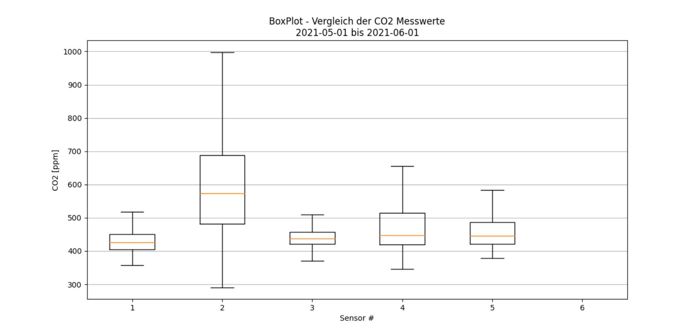
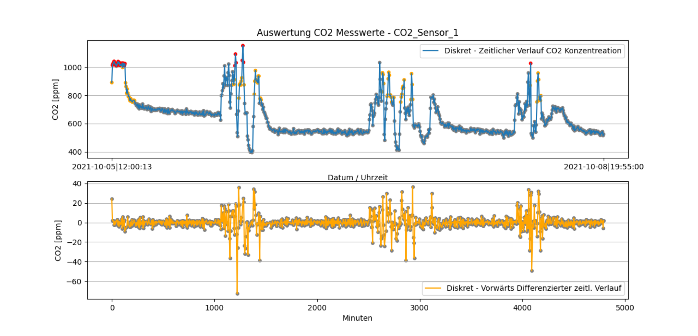
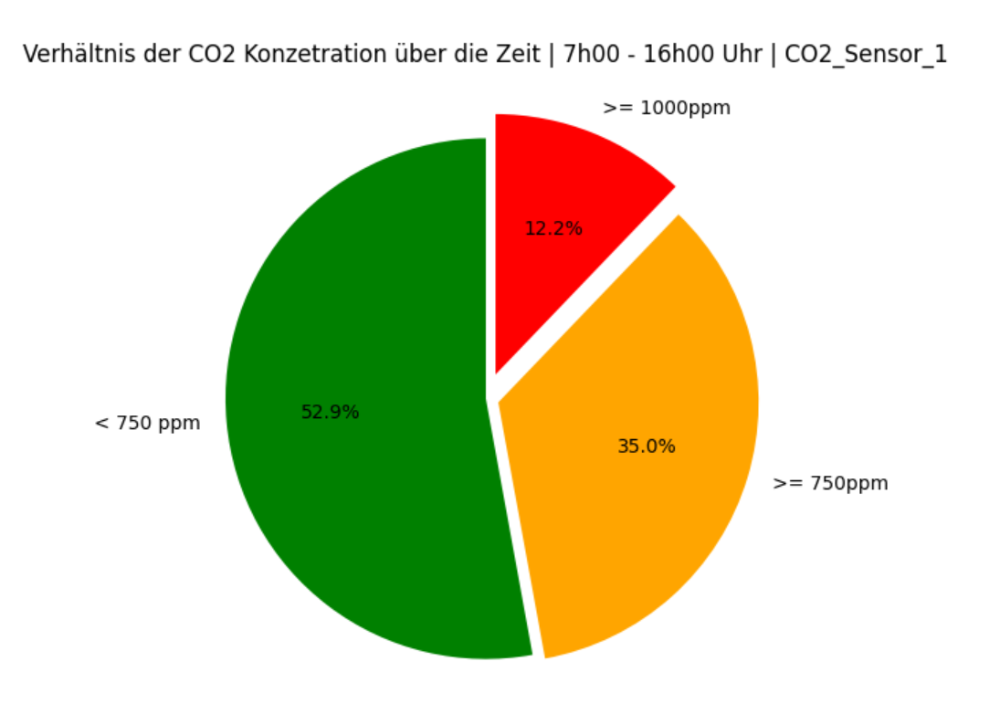
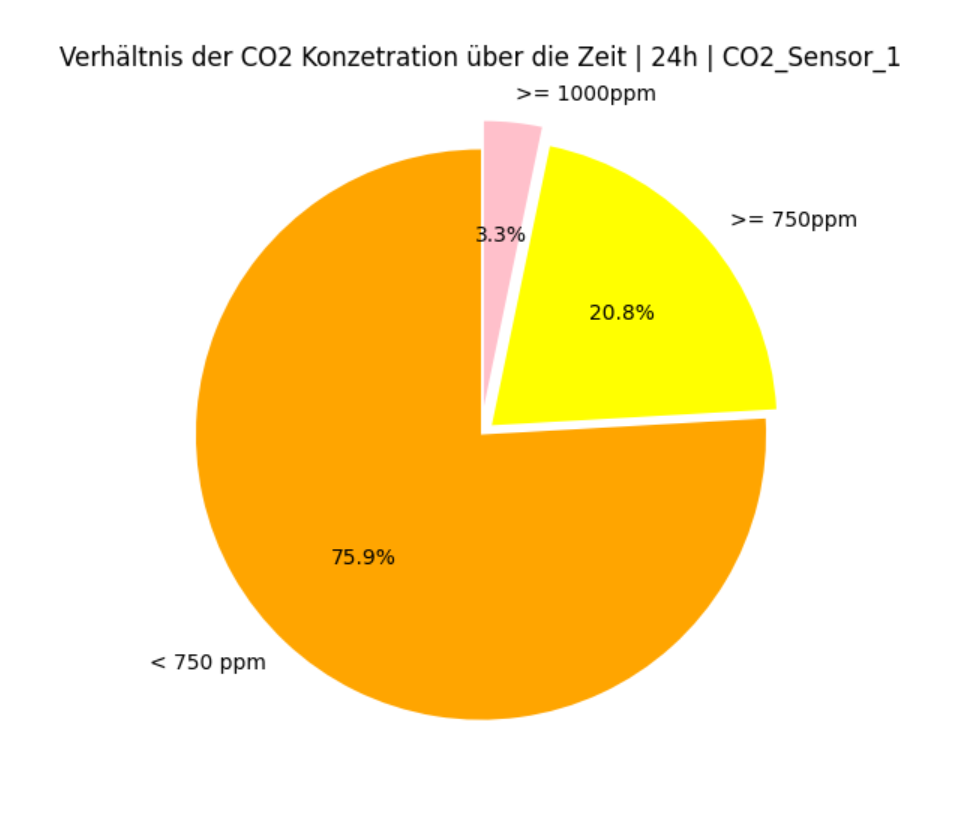

# Readme - CO2 Evalulation Script
These scripts are intended to evaluate the CO2 data we gathered from various LoRa devices. 

## Requirements
The following requirememts are necessary to execute the script:
* [Python 3](https://www.python.org/downloads/)
* Package [InfluxDB](https://pypi.org/project/influxdb/)
* Package [matplotlib](https://matplotlib.org/stable/users/installing.html)
* Package [Numpy](https://numpy.org/install/)

## Scope
* CO2_single_eval.py:
    1) Great for analyzing short time periods of a single sensor
    2) Will plot the data and its related rate i.e. forward differentiation (not completely validated yet, double check calculated values)
    3) Pie charts display the percentage distribution of datapoints which exceed the defined limits of 1000ppm and 750ppm

    **NOTE:** Theoretically it is possible to plot any range of data. However, a query of more than two weeks of datasets is impractical due to the visualization in the plot. 

* CO2_total_eval.py:
    1) Great to comprare all sensors/rooms over a large time period (boxplot)
    2) Will create a boxplot including all sensors defined in "CO2_Device_IDs.txt"

    **NOTE:** The explanatory power of the boxplot is not evaluated yet. The fact that we receive a different amount of datasets from every sensor in the same time range (e.g. due to instable connection) could effect the side by side comparison of multiple sensors.

## Usage
When executing the script, use --help to find the required arguments you need to pass. Please note to use the given date format for -sd and -ed.  

Always make sure to connect to the internal network of TH Ulm before evaluating the CO2 data with this script - either connect via VPN or use 'Eduroam' directly.

Whenever you're trying to evaluate data from more than 7 days, you should always keep track of possible data leaks! These can lead to a miscalucation of the pie diagram, for example due to the LoRa outage, unstable connection, ...

Example for single_eval: 
```console
python CO2_single_eval.py -id CO2_Sensor_1 -sd 2021-10-01 -ed 2021-10-02
```
Example for total_eval: 
```console
python CO2_total_eval.py -sd 2021-07-20 -ed 2021-09-01
```


**NOTE:** You need to specify the InfluxDB credentials within "InfluxDB_Query.py".


## Changelog
18.01.2021:
* Added new script for visualizing every sensors CO2 data in a boxplot diagram.
* Separated InfluxDB related code into a stand-alone module
* Fomrat changes within the code
* Removed the spline calculation and visualization due to inaccuracy

15.11.2021:
* Script will now create 4 plots:
    1) Discrete co2 concentration
    2) Approximated continous co2 concentration by using a spline
    3) Discrete forward difference of co2 concentration
    4) Approximated continous forward difference of co2 concentration
* **NOTE:** Double check whether ppm/min i.e forward difference is calculated corretly. 

09.11.2021: 
* Time plot will now color the datapoints only within the lecture relevant time slot of the day (currently set to 7h00 - 16h00)
* Time plot will now color datapoints according to their level of co2 concentration
    1) Above 1000ppm: Red
    2) Above 750ppm: Orange
    3) Below 750ppm: Grey
* A new pie chart allows the differentiation between the measurements during the whole day or just the lecture (currently set to 7h00 - 16h00)
* Both pie charts will now display the limit of 1000ppm and 750ppm
* To-Do: 
    1) Add Legend (With the current plot style not possible) 
    2) Fix explosion stlye on pie chart





